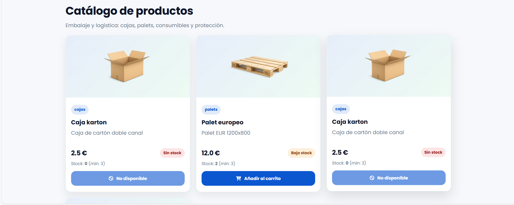
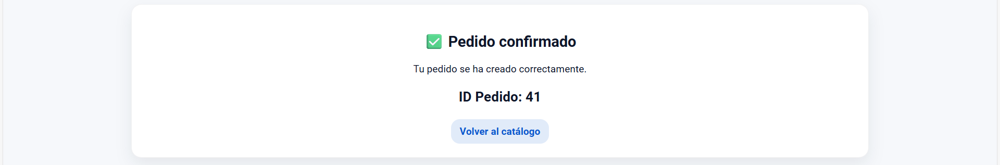
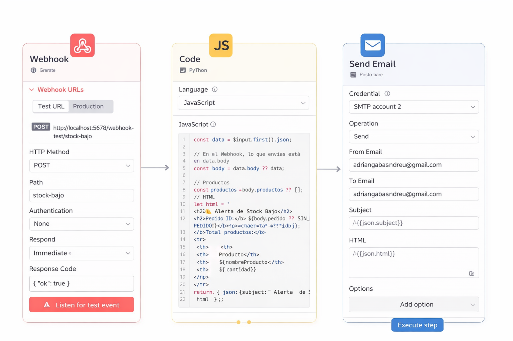
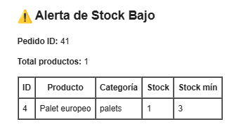

# Ecommerce Logística + Automatización de Stock

## 📌 Descripción

Aplicación web de ecommerce desarrollada en **Java (Servlets + JSP + patrón DAO)** conectada a **MariaDB**, con integración de automatización mediante **n8n (Docker)** para detectar stock bajo y enviar alertas automáticas por email.

El sistema simula un entorno real de logística donde, tras confirmar un pedido, el stock se actualiza y, si cae por debajo del mínimo configurado, se dispara una automatización vía webhook.

---

## 🏗️ Arquitectura del sistema

Cliente (Navegador)
↓
CheckoutServlet
↓
PedidoDao / ProductoDao
↓
MariaDB
↓
Validación de stock
↓
HTTP POST (Webhook)
↓
n8n (Docker)
↓
Envío de email (SMTP Gmail)

---

## 🛠️ Stack tecnológico

### Backend
- Java 21+
- Servlets + JSP
- Patrón DAO
- JDBC
- Maven (WAR)
- Apache Tomcat 9

### Base de datos
- MariaDB 11.x

### Automatización
- n8n (Docker)
- Webhook Trigger
- Nodo Code (JavaScript)
- Send Email (SMTP con App Password)

---

## 🔄 Flujo funcional

1. El usuario añade productos al carrito.
2. Confirma el pedido.
3. Se insertan:
   - Pedido
   - Líneas de pedido
4. Se actualiza el stock del producto.
5. Si `stock <= stock_min`, se envía un JSON vía HTTP POST al webhook de n8n.
6. n8n procesa los datos y envía un email HTML de alerta de stock bajo.

---

## 📸 Capturas del proyecto

### 🛒 Catálogo de productos

---

### 📦 Pedido confirmado

---

### 🔁 Workflow de automatización (n8n)

---

### 📧 Email automático de alerta

## 🔐 Decisiones técnicas

- Uso de patrón DAO para separar lógica de negocio y acceso a datos.
- Gestión transaccional en la creación de pedidos.
- Arquitectura basada en eventos (webhook en lugar de polling).
- Docker para aislar el servicio de automatización.
- Uso de contraseña de aplicación para envío seguro de correos.

---

## 🚀 Posibles mejoras futuras

- Implementación de API REST.
- Autenticación y control de roles.
- Tests unitarios.
- Dockerización completa del backend.
- Panel de administración.
